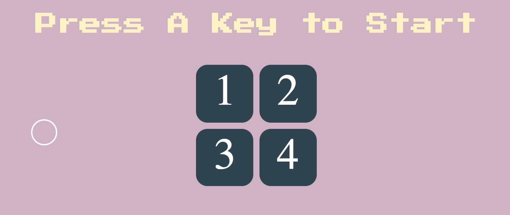
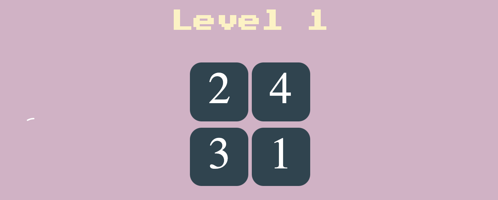
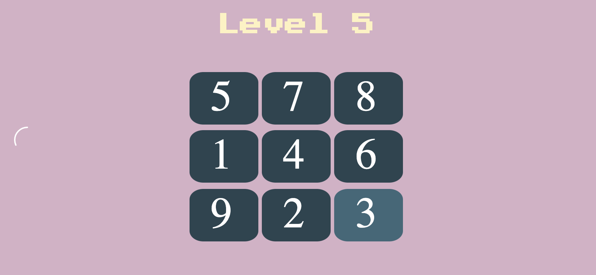

# Flip-the-Num-Card
A number memorization game

## How to play
1) Press any key to start
2) 5s to memorize, and then click the card in sequence

## In-Game screenshot

## Note
The sound effect and sound event trigger is borrowed from the project [Simon's Game](https://github.com/Zanzan666/game-trial) learned in [Angela Yu's Web developor course](https://www.udemy.com/course/the-complete-web-development-bootcamp/).
